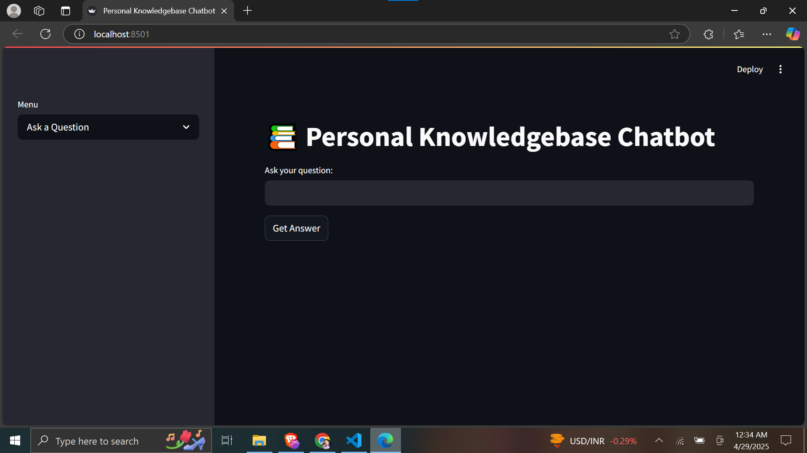

# 📚 RAG-Powered Document Chatbot

A **Retrieval-Augmented Generation (RAG)** project where users can upload documents, ask questions, and get AI-generated answers based on the uploaded content!

Built using **Python**, **LangChain**, **OpenAI API**, **Qdrant Vector Database**, **Streamlit**, and **Docker**.

---

## 🚀 Features
- Upload documents (.txt).
- Chunk and embed documents into a vector store (Qdrant).
- Semantic search and retrieval based on user queries.
- Generate contextual answers using OpenAI's LLMs.
- Lightweight, user-friendly frontend with Streamlit.
- Secure environment variables (.env).
- Dockerized for easy deployment.

---

## 🛠️ Tech Stack

| Backend  | Frontend | Database | DevOps  |
|:--------:|:--------:|:--------:|:-------:|
| Python + LangChain | Streamlit | Qdrant (Vector Store) | Docker |

---

## 📂 Project Structure

```
├── backend.py         # Handles document upload, indexing, querying
├── frontend.py        # Streamlit UI for chatting with documents
├── docker-compose.yml # Sets up Qdrant + services
├── .env               # Secure storage for API keys
├── README.md          # (This file!)
```

---

## ⚙️ How to Run Locally

### 1. Clone the Repo
```bash
git clone https://github.com/darshanchelani/knowledgebase-chatbot
cd knowledgebase-chatbot
```

### 2. Create `.env` File
```bash
OPENAI_API_KEY=your-openai-api-key
```

### 3. Start Qdrant
```bash
docker-compose up -d
```

### 4. Install Python Dependencies
```bash
pip install 
```

### 5. Run Backend and Frontend
```bash
streamlit run frontend.py
```

---

## 📸 Screenshots

> 

 

---

## 🤝 Let's Connect!

- [LinkedIn Profile](https://linkedin.com/in/darshankumar25)
- [GitHub Profile](https://github.com/darshanchelani)

---

# 📢 If you liked this project, please ⭐ the repository!

